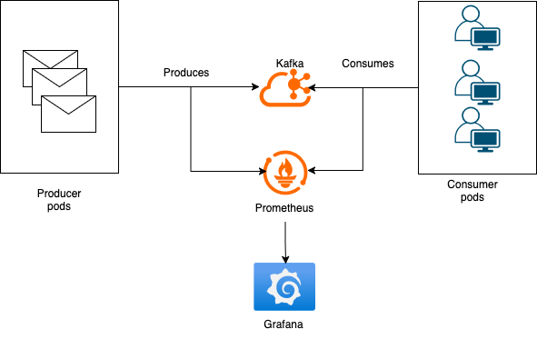

# Kafka Simulator

This project simulates the exchanging of messages between **producers** and **consumers**. Using a multi-broker Kafka setup, deployed using [Strimzi.io](https://strimzi.io/). Which provides a way to deploy Kafka components on Kubernetes through CRDs (Custom Resource Definitions).

## Architecture



- Dockerfile
  - Generic docker file:
    - Builds golang code
    - Copies the binaries into a slim image and will execute them based on the command provided by k8s.
- Kafka config map
  - Contains configurations used by all the Deployments.
- Kafka
  - Deployed on kubernetes using [Strimzi.io](https://strimzi.io/) (with Zookeeper).
  - Creates 2 topics in the deployment file.
    - Message topic
    - DLQ topic
- Producer
  - Deployed on Kubernetes with a custom number of replicas.
  - Contains Health Checks that verify the Kafka connection.
  - Produces message bursts, using a defined Protobuf message structure.
    - There is a 5% chance of producing an invalid message, for each message.
- Consumer
  - Deployed on Kubernetes with a custom number of replicas.
  - Contains Health Checks that verify the Kafka connection.
  - Creates a producer, that will be used to send messages to the DLQ topic.
  - Reads in messages from a topic.
    - If message is invalid, produce it to DLQ.

# Setup

```bash
# Create a cluster
kind create cluster

# Note: if it's the first time running, you must apply the config map first, in order for the setup.sh to not fail
pushd deployments
kubectl apply -f kafka-config.yaml
popd

# Setup kubernetes cluster
chmod +x setup.sh
./setup.sh <producers_replicas> <consumers_replicas>

# To delete cluster
kind delete cluster
```

# Health checks

To check the `Health checks` for consumers and producers, you can execute:

```bash
chmod +x healthcheck.sh
./healthcheck.sh consumer # for consumers pods
./healthcheck.sh producer # for producers pods
```

# Monitoring

To check the metrics in Prometheus:

```bash
kubectl port-forward service/prometheus-service 9090:9090 -n monitoring
```

[This link will show you all our custom rules](http://localhost:9090/query?g0.expr=kafka_consumer_valid_messages_total&g0.show_tree=0&g0.tab=table&g0.range_input=1h&g0.res_type=auto&g0.res_density=medium&g0.display_mode=lines&g0.show_exemplars=0&g1.expr=kafka_consumer_invalid_messages_total&g1.show_tree=0&g1.tab=table&g1.range_input=1h&g1.res_type=auto&g1.res_density=medium&g1.display_mode=lines&g1.show_exemplars=0&g2.expr=kafka_producer_valid_messages_total&g2.show_tree=0&g2.tab=table&g2.range_input=1h&g2.res_type=auto&g2.res_density=medium&g2.display_mode=lines&g2.show_exemplars=0&g3.expr=kafka_producer_invalid_messages_total&g3.show_tree=0&g3.tab=table&g3.range_input=1h&g3.res_type=auto&g3.res_density=medium&g3.display_mode=lines&g3.show_exemplars=0)
